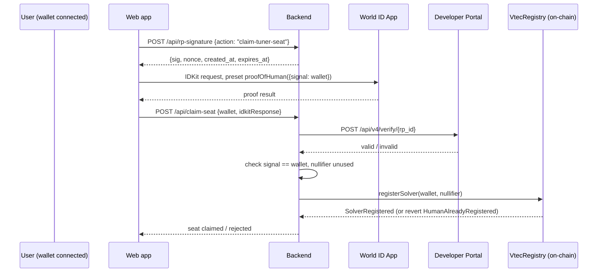
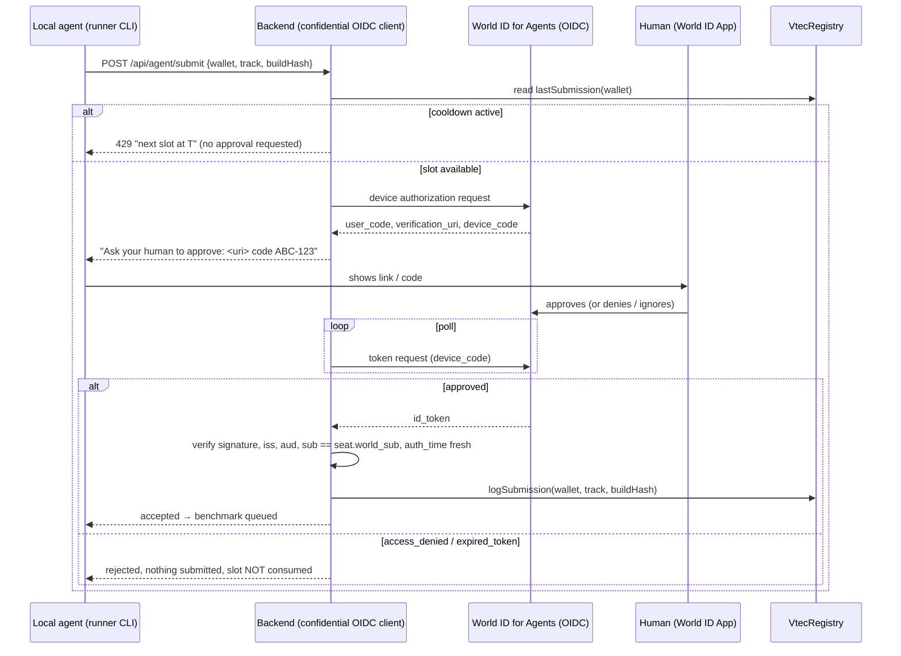
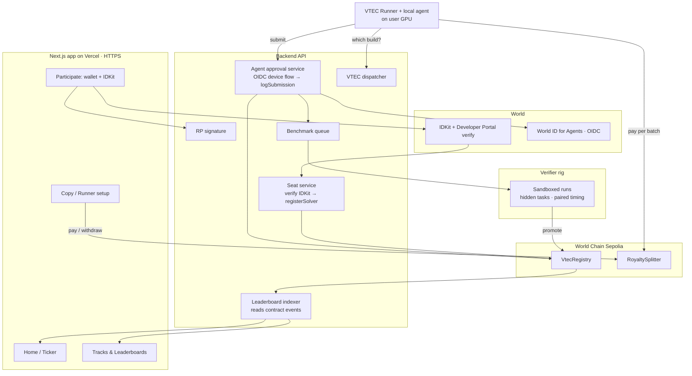

# GPU VTEC — Copy-Trading for Local AI Agents

> **Working title.** A platform that pays people to keep making **local AI agents** better on **specific consumer hardware** — and pays them **every time someone runs their build**, not once.
>
> ETHGlobal Tokyo 2026 build. Targets: **World — Best Use of IDKit** and **World — Best Use of World ID for Agents**.

---

## Table of Contents

1. [TL;DR](#1-tldr)
2. [Pitch Story — Why Local Agents, Why Now](#2-pitch-story--why-local-agents-why-now)
3. [Core Concept — the eToro Mapping](#3-core-concept--the-etoro-mapping)
4. [What a Tuner Submits: the Agent Build](#4-what-a-tuner-submits-the-agent-build)
5. [Challenge Model: Categories → Tracks → Variants](#5-challenge-model-categories--tracks--variants)
6. [Acceptance Rules — the "1% that is actually real" rule](#6-acceptance-rules--the-1-that-is-actually-real-rule)
7. [World Integration — Two Trust Moments](#7-world-integration--two-trust-moments)
8. [Wallet Integration](#8-wallet-integration)
9. [Smart Contracts (minimum set, with code)](#9-smart-contracts-minimum-set-with-code)
10. [Royalties — How Tuners Keep Earning](#10-royalties--how-tuners-keep-earning)
11. [Verification & Hardware Trust](#11-verification--hardware-trust)
12. [UI / UX — Page by Page](#12-ui--ux--page-by-page)
13. [System Architecture](#13-system-architecture)
14. [Data Model](#14-data-model)
15. [Phasing & Roadmap](#15-phasing--roadmap)
16. [Hackathon Demo Script](#16-hackathon-demo-script)
17. [World Prize Qualification Checklist](#17-world-prize-qualification-checklist)
18. [Differentiation](#18-differentiation)
19. [Risks & Mitigations](#19-risks--mitigations)
20. [Open Decisions](#20-open-decisions)
21. [Reusable Framework: Should This Task Become a Track?](#21-reusable-framework-should-this-task-become-a-track)
22. [Reference Links](#22-reference-links)

---

## 1. TL;DR

- **Problem:** Everyone's agent workflow depends on hosted frontier models whose price, quotas and terms can change any month.
- **Hedge:** Local agents (open-weight model + runtime + harness) running on hardware people already own.
- **Gap:** Local agents are only good if someone keeps tuning them _for that exact GPU and task_. Nobody is paid to do that continuously.
- **Solution:** A leaderboard per _task × GPU × size_. Tuners submit **agent builds**. A build is promoted only if it's **≥ 1% better beyond measurement noise**. Users **copy** builds (like eToro copy-trading) through a runner, and **every run pays the tuner** — plus a share to whoever they built on.
- **Trust:** World ID gives one tuner seat per human (IDKit, Proof of Human) and requires a fresh human approval whenever a tuner's local agent tries to submit (World ID for Agents). One submission per 48h per human.
- **On-chain:** Two tiny contracts — a **registry** (seats, 48h cooldown, records) and a **royalty splitter** (pay-per-run, pull withdrawals).

---

## 2. Pitch Story — Why Local Agents, Why Now

**The dependency risk**
Today, most agentic work runs on hosted frontier models (Claude, Codex/GPT, Gemini and others). That's great — until:

- prices go up month after month,
- quotas and rate limits tighten,
- terms, model behaviour or availability change without notice.

At some point, for some workloads, the hosted option stops being worth it. **You need an agent you control, running on hardware you own.**

**Why it's not solved by "just run a local model"**
A local agent is a stack of choices: which open-weight model, which quantization, which runtime flags, which context size, which harness and prompts, which tools. The best stack for an **RTX 4060 (8 GB)** is different from the best stack for a bigger 16–24 GB card, and different again for a 2-minute vs. 10-minute job. Getting this right takes continuous, hardware-specific tuning.

**Our bet**
It may not be urgent today. That's exactly why the incentive layer should exist _before_ it's needed: build a market that keeps local agents improving on real consumer hardware, so the fallback is already good when people need it.

**One-liner:** _eToro copy-trading for local AI agents — the best tuned build for your GPU wins the spotlight, and earns royalties for as long as people run it._

**Pitch big, demo small:** any task, any consumer GPU. We demo **one** track end to end and show every other track is one config file away.

---

## 3. Core Concept — the eToro Mapping

| eToro copy-trading         | GPU VTEC                                                                      |
| -------------------------- | ----------------------------------------------------------------------------- |
| Trader                     | **Tuner** — a verified human, often driving their own local agent             |
| Trade performance          | **Verified improvement** of an agent build on a track (e.g. +6.8% tasks/hour) |
| Popular Investor ranking   | **Variant leaderboard** + global top earners panel                            |
| Copy a trader              | **Copy a tuner** on a track → your runner auto-uses their builds              |
| Copy mirrors future trades | Copy auto-pulls the **tuner's future improvements**                           |
| "Copy the best" portfolio  | **Follow Track Best** → always run the current #1 for your GPU                |
| Payouts by copied volume   | **Royalties per run**, paid on-chain                                          |

> Copying a build by hand gives a **stale snapshot**. Copying through the runner gives **automatic upgrades, verified on your GPU class** — that's what users pay for.

---

## 4. What a Tuner Submits: the Agent Build

An **agent build** is everything needed to reproduce a local agent on a given machine. No model weights are uploaded — the manifest points to public open-weight releases at a pinned revision.

```yaml
# build.yaml
track: agent.coding.bugfix
variant: rtx4060-8gb.small-suite
model:
  source: "<open-weight model repo>"
  revision: "<pinned revision>"
  quant: "Q4_K_M"
runtime:
  engine: "llama.cpp" # or vLLM / Ollama / etc.
  version: "<pinned>"
  flags: { ctx: 8192, gpu_layers: "all", batch: 512, flash_attn: true }
harness:
  repo: "https://github.com/<tuner>/<agent>"
  commit: "a3f9c1e"
  entry: "python agent.py --task {task_dir}"
parent_record_id: 12 # the record this build improves on (0 = none)
declared_helpers: ["Opus 5"] # AI models used to *develop* the build (shown on leaderboard)
```

**Build hash** = `keccak256(build.yaml)`. That's what goes on-chain and what the leaderboard's "hash" column shows.

---

## 5. Challenge Model: Categories → Tracks → Variants

```
Category            Track                              Variants (each = own leaderboard)
────────────────    ───────────────────────────────    ───────────────────────────────────────
Coding agents   →   Bug-fix (unit-tested tasks)    →   RTX 4060 8GB · small suite   ← hackathon demo
                                                       RTX 4060 8GB · large suite

ZK / GPU agents →   Kernel optimizer (SHA-256)     →   RTX 4060 8GB · 20-min budget

Media agents    →   Video edit/render pipeline     →   RTX 4060 · 2-min clip
                                                       RTX 4060 · 5-min clip
                                                       RTX 4060 · 10-min clip
```

**Why variants:** the best build for a 2-minute clip may lose at 10 minutes (VRAM pressure, thermal throttling). Separate leaderboards let the **VTEC dispatcher** pick a different winner per GPU and job size — like VTEC switching cam profiles at different RPMs.

### Track config (one file = one leaderboard)

```yaml
track_id: agent.coding.bugfix
variant_id: rtx4060-8gb.small-suite
hardware:
  gpu: "NVIDIA GeForce RTX 4060 (8 GB)"
  driver: "pinned per season"
  power_limit_w: fixed
eval:
  public_tasks: "suites/small/public/" # tuners can see these
  hidden_tasks: "suites/small/hidden/" # rotated each season, never published
  correctness: unit_tests # a task counts only if all tests pass
  quality_floor: 0.60 # must solve ≥ 60% of hidden tasks
metric:
  name: "solved tasks / hour"
  direction: higher_is_better
benchmark:
  paired_runs: 10 # interleaved: candidate vs. current best
  min_gain_pct: 1.0
submission:
  cooldown_hours: 48
royalty:
  suggested_price_per_run_eth: 0.00001
```

**Metric in plain words:** a build must first clear the quality floor (solves enough hidden tasks correctly). Among builds that clear it, the one that **solves the most tasks per hour** on that GPU wins. That rewards both "smarter" and "faster", and can't be gamed by solving two easy tasks very quickly.

---

## 6. Acceptance Rules — the "1% that is actually real" rule

A build is **promoted** only if:

1. **Correct enough** — clears the track's quality floor on hidden tasks.
2. **At least 1% better** than the current record on the median of paired runs.
3. **Better than the noise** — the gain still holds in the pessimistic case.

**How rule 3 works (plain language):**

- The verifier runs the **current best** and the **new build** back-to-back, alternating, so both see the same temperature and clocks.
- It takes a **conservative estimate** of the true gain (the low end of a 95% confidence range).
- Promoted only if that conservative number is **≥ 1%**. On a quiet rig, a real 1.2% gain passes; on a noisy rig you need to prove more.

| Result           | Median gain | Conservative gain | Outcome             |
| ---------------- | ----------- | ----------------- | ------------------- |
| Clearly better   | +6.8%       | +5.9%             | ✅ Promoted         |
| Small, quiet rig | +1.4%       | +1.1%             | ✅ Promoted         |
| Small, noisy rig | +1.4%       | +0.3%             | ⚠️ Not promoted     |
| Lucky run        | +2.0%       | −0.8%             | ❌ Rejected (noise) |

The contract also enforces a **1% floor** on-chain as a sanity check (§9); the noise check is off-chain.

### Leaderboard row fields

| Field                  | Example                                     |
| ---------------------- | ------------------------------------------- |
| Rank                   | 01                                          |
| Tuner + ✅ human badge | `terrapinelf` ✅                            |
| Wallet                 | `0x7c1e…a40b`                               |
| World ID seat          | ✅ verified (nullifier never shown in full) |
| Dev helpers            | Opus 5 · GPT-6 Astra · none                 |
| Metric                 | 41.3 solved tasks/hour                      |
| Absolute change        | +2.6 tasks/hour                             |
| % change               | +6.76%                                      |
| Conservative gain      | +5.9%                                       |
| Build hash             | `0x9f2c…e1`                                 |
| Code link              | repo @ `a3f9c1e`                            |
| Parent                 | builds on #04 by `odinfree`                 |
| Copiers / runs         | 128 · 2.1M                                  |
| Earned                 | 0.42 ETH                                    |

---

## 7. World Integration — Two Trust Moments

The IDKit prize asks for _the minimum sufficient credential for a real trust moment_. We have two distinct moments, so we use two distinct World products.

| #     | Trust moment                                                                                    | What could go wrong without it                                                                              | World product           | Credential / check                                                |
| ----- | ----------------------------------------------------------------------------------------------- | ----------------------------------------------------------------------------------------------------------- | ----------------------- | ----------------------------------------------------------------- |
| **A** | **Claiming a tuner seat** (can earn royalties, can submit)                                      | One person farms many seats → multiplies 48h submission slots and wins on noise; royalties get Sybil-farmed | **IDKit**               | **Proof of Human**, uniqueness request, `signal = wallet address` |
| **B** | **A local agent submits a build** (burns the human's 48h slot, publishes code under their name) | An autonomous or hijacked agent submits junk, wastes the slot, or submits on someone's behalf               | **World ID for Agents** | Fresh human authentication at the moment of submission            |

### A. IDKit — Proof of Human seat

**Why Proof of Human is the _minimum sufficient_ credential**

- **Passport** proves document ownership, excludes people without an NFC passport, and isn't needed — we don't care about nationality or age.
- **Selfie Check** is medium assurance with a Sybil score — reasonable for low-stakes access, but here a duplicate seat directly doubles someone's attempts at a paid, scarce leaderboard slot.
- **Proof of Human** is the lowest credential that makes "one human = one seat" hold when money is on the line.

**Meaningful alternative path:** a user without Proof of Human can still **browse, copy builds and pay for runs**. They just can't hold a tuner seat. A human who already has a seat is **rejected** (same nullifier) — and the contract rejects it too.

**Flow**



**Backend: RP signature** (never on the client)

```ts
// app/api/rp-signature/route.ts
import { NextResponse } from "next/server";
import { signRequest } from "@worldcoin/idkit-core/signing";

export async function POST(req: Request) {
  const { action } = await req.json();
  const { sig, nonce, createdAt, expiresAt } = signRequest({
    signingKeyHex: process.env.RP_SIGNING_KEY!,
    action,
  });
  return NextResponse.json({
    sig,
    nonce,
    created_at: createdAt,
    expires_at: expiresAt,
  });
}
```

**Frontend: request the proof**

```tsx
import {
  IDKitRequestWidget,
  proofOfHuman,
  type RpContext,
} from "@worldcoin/idkit";
import { useAccount } from "wagmi";

export function ClaimSeat({ rpContext }: { rpContext: RpContext }) {
  const { address } = useAccount();
  const [open, setOpen] = useState(false);
  if (!address) return <ConnectWalletButton />;

  return (
    <IDKitRequestWidget
      open={open}
      onOpenChange={setOpen}
      app_id={process.env.NEXT_PUBLIC_WLD_APP_ID!}
      action="claim-tuner-seat"
      rp_context={rpContext}
      allow_legacy_proofs={true}
      preset={proofOfHuman({ signal: address })} // binds the proof to this wallet
      handleVerify={async (result) => {
        const res = await fetch("/api/claim-seat", {
          method: "POST",
          headers: { "content-type": "application/json" },
          body: JSON.stringify({ wallet: address, idkitResponse: result }),
        });
        if (!res.ok) throw new Error((await res.json()).error); // shows rejection path
      }}
      onSuccess={() => toast("Tuner seat claimed ✅")}
    />
  );
}
```

**Backend: verify + register on-chain**

```ts
// app/api/claim-seat/route.ts
import { NextResponse } from "next/server";
import { attester, REGISTRY, registryAbi } from "@/lib/chain";

export async function POST(req: Request) {
  const { wallet, idkitResponse } = await req.json();

  // 1. Forward the IDKit result unchanged to the Developer Portal
  const v = await fetch(
    `https://developer.world.org/api/v4/verify/${process.env.WLD_RP_ID}`,
    {
      method: "POST",
      headers: { "content-type": "application/json" },
      body: JSON.stringify(idkitResponse),
    },
  );
  if (!v.ok)
    return NextResponse.json(
      { error: "World ID proof invalid" },
      { status: 400 },
    );

  const r = idkitResponse.responses[0];

  // 2. Enforce the signal: proof must be bound to this wallet
  //    (recompute with IDKit's signal-hash helper and compare to r.signal_hash)
  if (!signalMatches(r.signal_hash, wallet))
    return NextResponse.json(
      { error: "Proof not bound to this wallet" },
      { status: 400 },
    );

  // 3. One human = one seat. Store nullifier as a number, not a string.
  const nullifier = BigInt(r.nullifier);
  if (await db.nullifierExists(nullifier))
    return NextResponse.json(
      { error: "This human already has a tuner seat" },
      { status: 409 },
    );

  // 4. Attest on-chain (contract re-checks uniqueness)
  const hash = await attester.writeContract({
    address: REGISTRY,
    abi: registryAbi,
    functionName: "registerSolver",
    args: [wallet, nullifier],
  });
  await db.saveSeat({ wallet, nullifier, tx: hash });
  return NextResponse.json({ ok: true, tx: hash });
}
```

**DB (from World's guidance):**

```sql
CREATE TABLE seats (
  nullifier   NUMERIC(78,0) NOT NULL UNIQUE,  -- 256-bit nullifier as a number
  wallet      TEXT NOT NULL UNIQUE,
  world_sub   TEXT UNIQUE,                    -- filled in by moment B setup
  created_at  TIMESTAMPTZ NOT NULL DEFAULT NOW()
);
```

### B. World ID for Agents — fresh approval before an agent submits

**The story:** a tuner leaves their local agent running overnight, auto-tuning its own build (trying quants, flags, prompts). When it finds a candidate it believes beats the record, it wants to submit — but a submission **spends the human's one slot per 48h** and publishes under their name. So the agent must get a **fresh "yes" from the human** first.

**How World ID for Agents works (sandbox for the event):**

- It's an **OpenID Connect** identity provider ("Human Continuity"). Each app gets a **private, stable identifier per human** (the `sub` claim) — the same human always maps to the same `sub` for our app.
- It supports **fresh authentication** for important moments and a **device authorization grant** for CLI/agent logins with explicit human approval.
- Endpoints come from the issuer's discovery metadata. Register the OIDC client in the sandbox portal (or via the World ID agent plugin in Claude Code / Codex).

**Linking the two identities:** right after claiming a seat (moment A), the user clicks **"Link World ID sign-in"** once. We store their `sub` on the seat. From then on, moment B's `sub` must match that seat.

**Flow**



**Backend sketch: start approval + validate result**

```ts
// lib/world-agents.ts
import { createRemoteJWKSet, jwtVerify } from "jose";

const ISSUER = process.env.WORLD_AGENTS_ISSUER!; // sandbox issuer
const disc = await fetch(`${ISSUER}/.well-known/openid-configuration`).then(
  (r) => r.json(),
);
const JWKS = createRemoteJWKSet(new URL(disc.jwks_uri));
const clientAuth =
  "Basic " +
  btoa(`${process.env.WA_CLIENT_ID}:${process.env.WA_CLIENT_SECRET}`);

export async function startApproval() {
  // If discovery has no device_authorization_endpoint, fall back to an
  // authorization-code link with max_age for freshness.
  const res = await fetch(disc.device_authorization_endpoint, {
    method: "POST",
    headers: {
      authorization: clientAuth,
      "content-type": "application/x-www-form-urlencoded",
    },
    body: new URLSearchParams({ scope: "openid" }),
  });
  return res.json(); // { device_code, user_code, verification_uri(_complete), expires_in, interval }
}

export async function pollApproval(deviceCode: string) {
  const res = await fetch(disc.token_endpoint, {
    method: "POST",
    headers: {
      authorization: clientAuth,
      "content-type": "application/x-www-form-urlencoded",
    },
    body: new URLSearchParams({
      grant_type: "urn:ietf:params:oauth:grant-type:device_code",
      device_code: deviceCode,
    }),
  });
  const body = await res.json();
  if (body.error) return { status: body.error }; // authorization_pending | slow_down | access_denied | expired_token
  return { status: "approved", idToken: body.id_token };
}

export async function validateFreshHuman(
  idToken: string,
  expectedSub: string,
  maxAgeSec = 300,
) {
  const { payload } = await jwtVerify(idToken, JWKS, {
    issuer: disc.issuer,
    audience: process.env.WA_CLIENT_ID,
  });
  if (payload.sub !== expectedSub)
    throw new Error("Different human than the seat owner");
  const authTime = Number(payload.auth_time ?? payload.iat);
  if (Date.now() / 1000 - authTime > maxAgeSec)
    throw new Error("Approval not fresh");
  return payload;
}
```

**Gotchas from the sandbox docs**

- Sandbox callbacks must be **HTTPS** (no `http://localhost`) → deploy to Vercel (or tunnel) on day one.
- Portal approval links for app registration expire in ~20 minutes.
- Sandbox proofs use **fake identities** — fine for the demo, never for production.
- Keep the client secret in backend env only; the agent never sees it and never receives authorization directly — the **backend** decides and performs the protected action.

---

## 8. Wallet Integration

**Chain:** World Chain Sepolia (testnet) for the hackathon — same ecosystem as World ID; mainnet later.
**Stack:** `wagmi` + `viem` in the Next.js app; `viem` wallet client for the backend attester and for the runner.

| Who                  | Wallet does what                                                                               |
| -------------------- | ---------------------------------------------------------------------------------------------- |
| **Tuner**            | Connects wallet → claims seat (wallet is the IDKit signal) → receives royalties → `withdraw()` |
| **Copier**           | Connects wallet → picks Copy Tuner / Follow Best → pays for runs via `pay()`                   |
| **Runner CLI**       | Uses a small funded key (testnet) to batch-pay every N runs                                    |
| **Backend attester** | Server key that calls `registerSolver`, `logSubmission`, `promote`                             |

**wagmi config**

```ts
// lib/wagmi.ts
import { http, createConfig } from "wagmi";
import { worldchainSepolia } from "wagmi/chains"; // check your wagmi/viem version exports it
import { injected, walletConnect } from "wagmi/connectors";

export const config = createConfig({
  chains: [worldchainSepolia],
  connectors: [
    injected(),
    walletConnect({ projectId: process.env.NEXT_PUBLIC_WC_ID! }),
  ],
  transports: { [worldchainSepolia.id]: http() },
});
```

**Copier pays for runs**

```ts
import { useWriteContract } from "wagmi";
import { parseEther } from "viem";

const { writeContract } = useWriteContract();
writeContract({
  address: SPLITTER,
  abi: splitterAbi,
  functionName: "pay",
  args: [recordId, 100n], // paying for a batch of 100 runs
  value: parseEther("0.001"), // 100 × 0.00001 ETH
});
```

**Tuner withdraws**

```ts
writeContract({
  address: SPLITTER,
  abi: splitterAbi,
  functionName: "withdraw",
});
```

**Backend attester**

```ts
// lib/chain.ts
import { createWalletClient, http } from "viem";
import { privateKeyToAccount } from "viem/accounts";
import { worldchainSepolia } from "viem/chains";

export const attester = createWalletClient({
  account: privateKeyToAccount(process.env.ATTESTER_KEY as `0x${string}`),
  chain: worldchainSepolia,
  transport: http(process.env.WORLDCHAIN_SEPOLIA_RPC),
});
```

---

## 9. Smart Contracts (minimum set, with code)

**Only two contracts.** Everything else (benchmarks, leaderboards, files) stays off-chain.

| Contract          | Job                                                               | Why on-chain                                        |
| ----------------- | ----------------------------------------------------------------- | --------------------------------------------------- |
| `VtecRegistry`    | Tuner seats (1 per human), 48h cooldown, promoted records         | Rules and record history nobody can quietly rewrite |
| `RoyaltySplitter` | Pay-per-run, split to tuner / parent / treasury, pull withdrawals | Transparent, automatic payouts incl. lineage        |

**Deliberately left out for v0:** verifier staking, ERC-20 payments, upgradeability, on-chain World ID verification. The backend is a trusted **attester** for now (see §19).

### `VtecRegistry.sol`

```solidity
// SPDX-License-Identifier: MIT
pragma solidity ^0.8.24;

/// @notice Tuner seats, 48h submission cooldown, and promoted records.
/// The attester is our backend: it only calls these after checking World ID
/// (seats), World ID for Agents approval (submissions), or benchmarks (records).
contract VtecRegistry {
    struct Record {
        bytes32 trackId;     // keccak256("agent.coding.bugfix/rtx4060-8gb.small-suite")
        address solver;      // tuner wallet
        bytes32 buildHash;   // keccak256(build.yaml)
        uint256 score;       // higher is better, e.g. solved tasks/hour × 1000
        uint256 parentId;    // record this build improved on (0 = none)
        uint64  timestamp;
    }

    address public immutable attester;
    uint256 public immutable cooldown;           // 48 hours in prod, minutes for demo

    mapping(uint256 => bool) public nullifierUsed;
    mapping(address => bool) public isSolver;
    mapping(address => uint64) public lastSubmission;
    mapping(bytes32 => uint256) public bestRecord;  // trackId => record id

    Record[] private _records;                      // record id = index + 1

    event SolverRegistered(address indexed solver);
    event Submitted(address indexed solver, bytes32 indexed trackId, bytes32 buildHash);
    event Promoted(uint256 indexed recordId, bytes32 indexed trackId, address indexed solver,
                   uint256 score, uint256 parentId);

    error NotAttester();
    error HumanAlreadyRegistered();
    error WalletAlreadyRegistered();
    error NotSolver();
    error CooldownActive(uint256 readyAt);
    error GainBelowOnePercent();
    error BadParent();
    error NoRecord();

    constructor(address _attester, uint256 _cooldown) {
        attester = _attester;
        cooldown = _cooldown;
    }

    modifier onlyAttester() {
        if (msg.sender != attester) revert NotAttester();
        _;
    }

    /// Called after the backend verified a Proof of Human with signal = wallet.
    function registerSolver(address wallet, uint256 nullifier) external onlyAttester {
        if (nullifierUsed[nullifier]) revert HumanAlreadyRegistered();
        if (isSolver[wallet]) revert WalletAlreadyRegistered();
        nullifierUsed[nullifier] = true;
        isSolver[wallet] = true;
        emit SolverRegistered(wallet);
    }

    /// Called after the human freshly approved their agent's submission.
    function logSubmission(address solver, bytes32 trackId, bytes32 buildHash) external onlyAttester {
        if (!isSolver[solver]) revert NotSolver();
        uint256 last = lastSubmission[solver];
        if (last != 0 && block.timestamp < last + cooldown) revert CooldownActive(last + cooldown);
        lastSubmission[solver] = uint64(block.timestamp);
        emit Submitted(solver, trackId, buildHash);
    }

    /// Called after the noise-aware benchmark says the build is a real ≥1% gain.
    function promote(
        bytes32 trackId,
        address solver,
        bytes32 buildHash,
        uint256 score,
        uint256 parentId
    ) external onlyAttester returns (uint256 id) {
        if (!isSolver[solver]) revert NotSolver();
        if (parentId > _records.length) revert BadParent();
        if (parentId != 0 && _records[parentId - 1].trackId != trackId) revert BadParent();

        uint256 best = bestRecord[trackId];
        // on-chain sanity floor: new score must be ≥ 101% of the current record
        if (best != 0 && score * 100 < _records[best - 1].score * 101) revert GainBelowOnePercent();

        _records.push(Record(trackId, solver, buildHash, score, parentId, uint64(block.timestamp)));
        id = _records.length;
        bestRecord[trackId] = id;
        emit Promoted(id, trackId, solver, score, parentId);
    }

    function getRecord(uint256 id) external view returns (Record memory) {
        if (id == 0 || id > _records.length) revert NoRecord();
        return _records[id - 1];
    }

    function recordCount() external view returns (uint256) {
        return _records.length;
    }
}
```

### `RoyaltySplitter.sol`

```solidity
// SPDX-License-Identifier: MIT
pragma solidity ^0.8.24;

import {VtecRegistry} from "./VtecRegistry.sol";

/// @notice Copiers pay per batch of runs for a specific record.
/// Split: 75% record's tuner, 15% parent record's tuner, 10% treasury.
/// If there's no parent (or the parent is the same tuner), the tuner gets 90%.
/// Pull-payment: everyone withdraws their own balance.
contract RoyaltySplitter {
    VtecRegistry public immutable registry;
    address public immutable treasury;

    uint256 public constant PARENT_BPS = 1500;    // 15%
    uint256 public constant TREASURY_BPS = 1000;  // 10%

    mapping(address => uint256) public owed;

    event Paid(uint256 indexed recordId, address indexed payer, uint256 runs, uint256 amount);
    event Withdrawn(address indexed to, uint256 amount);

    constructor(VtecRegistry _registry, address _treasury) {
        registry = _registry;
        treasury = _treasury;
    }

    /// Copy Tuner: pay the record you pinned. Follow Best: pay registry.bestRecord(track).
    function pay(uint256 recordId, uint256 runs) external payable {
        require(msg.value > 0, "no payment");
        VtecRegistry.Record memory r = registry.getRecord(recordId);

        uint256 toTreasury = (msg.value * TREASURY_BPS) / 10_000;
        uint256 toParent;

        if (r.parentId != 0) {
            address parentSolver = registry.getRecord(r.parentId).solver;
            if (parentSolver != r.solver) {
                toParent = (msg.value * PARENT_BPS) / 10_000;
                owed[parentSolver] += toParent;
            }
        }

        owed[treasury] += toTreasury;
        owed[r.solver] += msg.value - toTreasury - toParent;
        emit Paid(recordId, msg.sender, runs, msg.value);
    }

    function withdraw() external {
        uint256 amount = owed[msg.sender];
        require(amount > 0, "nothing owed");
        owed[msg.sender] = 0;                          // effects before interaction
        (bool ok, ) = msg.sender.call{value: amount}("");
        require(ok, "transfer failed");
        emit Withdrawn(msg.sender, amount);
    }
}
```

### Deploy (Foundry)

```bash
forge init vtec-contracts && cd vtec-contracts
# put both files in src/

# Demo deployment: 120-second cooldown so the cooldown can be shown live
forge create src/VtecRegistry.sol:VtecRegistry \
  --rpc-url $WORLDCHAIN_SEPOLIA_RPC --private-key $DEPLOYER_KEY --broadcast \
  --constructor-args $ATTESTER_ADDR 120

# Real rules deployment: 48h = 172800 seconds
forge create src/VtecRegistry.sol:VtecRegistry \
  --rpc-url $WORLDCHAIN_SEPOLIA_RPC --private-key $DEPLOYER_KEY --broadcast \
  --constructor-args $ATTESTER_ADDR 172800

forge create src/RoyaltySplitter.sol:RoyaltySplitter \
  --rpc-url $WORLDCHAIN_SEPOLIA_RPC --private-key $DEPLOYER_KEY --broadcast \
  --constructor-args $REGISTRY_ADDR $TREASURY_ADDR
```

### Minimum tests (Foundry)

- [ ] Same nullifier twice → `HumanAlreadyRegistered`
- [ ] Two submissions inside cooldown → `CooldownActive`
- [ ] Promote with +0.5% → `GainBelowOnePercent`; with +1% → succeeds
- [ ] `pay()` with parent → 75 / 15 / 10 split; without parent → 90 / 0 / 10
- [ ] `withdraw()` zeroes balance and transfers

---

## 10. Royalties — How Tuners Keep Earning

**Where money comes from:** copiers run builds through the **VTEC Runner**. The runner counts runs and batch-pays `RoyaltySplitter.pay(recordId, runs)` every N runs.

| Copy mode             | Behaviour                                              | Who gets paid                        |
| --------------------- | ------------------------------------------------------ | ------------------------------------ |
| **Copy Tuner**        | Pin one tuner on a track; auto-get their future builds | That tuner — even after they lose #1 |
| **Follow Track Best** | Always run `bestRecord(track)` for your GPU            | Whoever is champion at run time      |

**Lineage:** a build that improves on someone else's shares 15% with the parent tuner. Undeclared forks are caught by a similarity check on the harness/config and get a parent assigned before promotion.

**Honest limitation:** builds are public (they must be, to be audited). Anyone can copy one by hand and never pay. We accept that — the paid product is **auto-upgrades + verified-on-your-GPU-class + the dispatcher**, the same way copy-trading beats reading a trader's old posts.

**Later:** savings-share pricing (pay a slice of what you'd have paid a hosted API for the same tasks) — directly ties the price to the pitch.

---

## 11. Verification & Hardware Trust

Consumer GPUs can't cryptographically prove which GPU ran a job. Trust comes from **who runs the benchmark**:

| Stage     | Verifier model                                                           |
| --------- | ------------------------------------------------------------------------ |
| Hackathon | One team-operated rig per variant, labelled as trusted                   |
| Alpha     | 2+ independent rigs per variant; must agree within the noise band        |
| Beta+     | Staked verifiers, slashed on disagreement (a third contract, added then) |

- **Correctness is clean:** unit tests pass or they don't (coding track); exact output match (ZK kernel track).
- **Hidden tasks** rotate each season so builds can't overfit the public suite.
- **Sandbox:** builds run in a locked container — no network, fixed time limit, read-only task files.
- **Seasons:** driver and runtime versions pinned per season; records re-baselined when they change.

---

## 12. UI / UX — Page by Page

Visual reference: Yukon-style challenge leaderboard — huge "current record" number, step-line record chart, dense monospaced rows, dark theme with one accent colour.

**Global header:** `GPU VTEC` · Tracks · Participate · **[Connect Wallet]** · seat badge (✅ once claimed).

### Page 1 — Home: Live Spotlight

```
┌──────────────────────────────────────────────────────────────────────┐
│ GPU VTEC                          [Tracks] [Participate] [Connect ▼] │
├──────────────────────────────────────────────────────────────────────┤
│ "What if your AI got 3× more expensive next month?"                  │
│  Local agents, tuned for your GPU, by people paid to keep improving. │
├──────────────────────────────────────────────────────────────────────┤
│ ▶ LIVE  terrapinelf +6.8% Coding·4060 ● fkiene earned 0.02 ETH …     │ ← ticker
├──────────────────────────────────────────────────────────────────────┤
│ TOP EARNERS (7D)       TOP IMPROVERS (7D)       HOTTEST TRACKS       │
│ 1 terrapinelf 0.42Ξ    1 anamdong… +20.8%       Coding · 4060   ▲    │
│ 2 fkiene      0.38Ξ    2 odinfree  +16.4%       Video · 5 min   ▲    │
│ 3 odinfree    0.20Ξ    3 fkiene    +16.2%       ZK · SHA-256    –    │
├──────────────────────────────────────────────────────────────────────┤
│ Featured track: record number + step-line chart   [Browse tracks →]  │
└──────────────────────────────────────────────────────────────────────┘
```

### Page 2 — All Tracks

Grid grouped by category. Card: name, GPU chips, current record, 7-day gain, # tuners, total royalties. Filter: **"Match my GPU"**.

### Page 3 — Track Detail (variant picker)

```
Media agents · Video edit/render
┌────────────┬────────────┬────────────┐
│ RTX 4060   │ RTX 4060   │ RTX 4060   │
│ 2 min clip │ 5 min clip │ 10 min clip│
│ 41.2 s     │ 1m 38s     │ 3m 21s     │
│ +3.1% 7d   │ +1.8% 7d   │ +0.0% 7d   │
└────────────┴────────────┴────────────┘
```

### Page 4 — Variant Leaderboard (core page)

- Header: CURRENT RECORD, promoted builds, # tuners.
- Tabs: **Improvement History** · **Leaderboard** · **Earnings**.
- Chart: record step-line; Lin/Log; 1H · 6H · 24H · 7D · All; "By dev helper" colouring.
- Columns: Rank · Tuner ✅ · Wallet · Helper · Metric · Δ abs · Δ % · Build hash · Code ↗ · Parent · Copiers · Earned · **[Copy]**
- Row expand: paired runs, noise band, conservative gain, diff vs. parent, on-chain tx links (`Submitted`, `Promoted`, `Paid`).

### Page 5 — Tuner Profile (eToro-style)

Handle, ✅ seat, wallet, records held, copiers, royalties chart, **Withdraw** button (if it's you), **Copy this tuner** per track.

### Page 6 — Participate (claim seat)

1. Connect wallet → 2. **Verify with World ID** (Proof of Human, bound to wallet) → 3. **Link World ID sign-in** (for agent approvals) → 4. Install runner.
   Shows rejection states clearly: _already has a seat_ · _cancelled_ · _no Proof of Human (you can still copy builds)_.

### Page 7 — Submissions (status)

Queued → human approval pending (code shown) → approved / denied / expired → correctness → benchmarking → promoted / not promoted. Cooldown timer until next slot.

### Page 8 — Copy / Runner setup

Choose Copy Tuner or Follow Best → pick GPU → fund runner → one-line install.

---

## 13. System Architecture



**Stack:** Next.js + Tailwind · wagmi/viem · `@worldcoin/idkit` v4 · `jose` (ID token checks) · Postgres · Redis queue · Docker (verifier sandbox) · llama.cpp / Ollama for local agents · Foundry (contracts) · World Chain Sepolia.

---

## 14. Data Model

```
Seat          { nullifier NUMERIC(78,0) UNIQUE, wallet UNIQUE, world_sub UNIQUE, created_at }
Track         { track_id, category, name, metric, direction, quality_floor }
Variant       { variant_id, track_id, gpu, job_size, config_yaml, track_hash }
Submission    { id, variant_id, wallet, build_hash, repo, commit, parent_record_id,
                approval_status (pending|approved|denied|expired), submit_tx, created_at }
BenchmarkRun  { id, submission_id, rig_id, pass_rate, median_gain_pct,
                conservative_gain_pct, noise_pct, promoted_record_id, promote_tx }
Copy          { wallet, variant_id, mode (tuner|best), pinned_record_id? }
-- royalties & records are read from contract events, not duplicated
```

---

## 15. Phasing & Roadmap

### Phase 0 — Scope lock (done / now)

- [x] Pitch: frontier-model dependency → local agents tuned per GPU
- [x] Target prizes: World IDKit + World ID for Agents (check whether both count as one partner slot)
- [ ] Freeze demo variant: **Coding bug-fix · RTX 4060 8GB · small suite (~20 unit-tested tasks)**
- [ ] Measure baseline build + rig noise (10 repeated runs)

### Phase 1 — Hackathon MVP (Sat 26 → Sun 27 submission)

**Block A — Plumbing first (Sat early)**

- [ ] Deploy both contracts to World Chain Sepolia (demo cooldown = 120s)
- [ ] Deploy Next.js skeleton to Vercel (HTTPS needed for sandbox callbacks)
- [ ] Developer Portal app → `app_id`, `rp_id`, signing key
- [ ] Register sandbox OIDC client (portal or agent plugin) → client ID/secret
- [ ] Wallet connect working (wagmi)

**Block B — Moment A: IDKit seat (Sat morning)**

- [ ] RP signature route · IDKit widget with `proofOfHuman({ signal: wallet })`
- [ ] Verify route → nullifier check → `registerSolver`
- [ ] Rejection paths: already-registered (DB + contract revert), cancelled

**Block C — Eval harness (Sat, in parallel)**

- [ ] Task suite (public + hidden) with unit tests
- [ ] Runner: load `build.yaml`, run agent per task in sandbox, count passes, time it
- [ ] Paired runs + conservative gain → `promote()`

**Block D — Moment B: agent approval (Sat afternoon/evening)**

- [ ] "Link World ID sign-in" (store `sub` on seat)
- [ ] `/api/agent/submit`: cooldown pre-check → device flow → validate ID token → `logSubmission`
- [ ] Denied / expired paths leave the slot unused

**Block E — Money + UI (Sat night)**

- [ ] Runner batch-pays `pay()`; Withdraw button on profile
- [ ] Home ticker, tracks grid, leaderboard from contract events, record chart
- [ ] Seed 3–4 real builds (baseline → tuned quant → tuned flags → tuned harness)

**Block F — Ship (Sun morning)**

- [ ] Recorded fallback demo video
- [ ] README + both **integration debriefs** (§17)
- [ ] Submission

**If time runs short, cut in this order:** video/ZK tracks (keep as mock cards) → lineage similarity check → dispatcher → chart polish. **Never cut:** both World flows with their failure paths, contracts, one real leaderboard.

**Exit:** a stranger claims a seat, their agent asks for approval, a build gets benchmarked and promoted on-chain, a copier pays, the tuner withdraws.

### Phase 2 — Private Alpha (weeks 1–6)

- 3 tracks on RTX 4060 8GB; ZK kernel-optimizer agent track added; second GPU tier only once there's a verifier rig for it
- 2 verifier rigs per variant; real 48h cooldown deployment
- Copy Tuner mode, profiles, earnings; lineage similarity check
- Invite 20–50 tuners (local-LLM communities, TBC, hackathon contacts)
- **Exit:** ≥ 1 new record/week/track sustained; ≥ 5 outside copiers running builds

### Phase 3 — Public Beta (months 2–4)

- Media-agent track (2 / 5 / 10-min clips on RTX 4060)
- VTEC dispatcher v1 (best build per GPU × job size at runtime)
- Stablecoin payments; mainnet contracts; savings-share pricing test
- Sponsored tracks (a company funds a treasury to get its workload tuned locally)
- **Exit:** a tuner earns meaningful monthly royalties from runs alone

### Phase 4 — Open Network (month 5+)

- Permissionless track creation (via §21 checklist + stake)
- Staked verifier contract with slashing
- On-chain World ID verification replacing the trusted attester where practical
- More hardware tiers (RTX 4090, Apple Silicon, small datacenter GPUs)

---

## 16. Hackathon Demo Script (3 minutes)

1. **Hook (20s):** "What if Claude, Codex or any hosted model got more expensive every month until it wasn't worth it? You'd need a local agent — and someone has to keep tuning it for your GPU."
2. **Home (15s):** ticker, top earners, hottest tracks.
3. **Moment A (35s):** connect wallet → World ID Proof of Human → seat claimed, tx on explorer. Then **same human tries again** → _"This human already has a tuner seat"_ + contract revert.
4. **Moment B (50s):** local agent in terminal finds a better build → asks for approval → code shown → human approves in World ID → submitted on-chain → benchmark → **promoted +X%**.
   Then: agent tries again → **denied in World ID** → nothing submitted, slot untouched. Then: cooldown active → rejected before asking.
5. **Noise rule (15s):** a "+1.3% lucky run" gets rejected.
6. **Copy & earn (35s):** second laptop runs `vtec run --follow best` → batch `pay()` → tuner's owed balance rises → **Withdraw**.
7. **Close (10s):** "One track today. Any local agent, any consumer GPU tomorrow."

---

## 17. World Prize Qualification Checklist

### Best Use of IDKit

- [ ] IDKit integrated in a working app (Participate page)
- [ ] Credential: **Proof of Human**, verified server-side via `POST /api/v4/verify/{rp_id}`, then attested on-chain
- [ ] Trust moment explained: _claiming a paid, rate-limited tuner seat_
- [ ] Minimum-sufficient rationale (§7A: why not Passport, why not Selfie Check)
- [ ] Success path + alternative paths: already-registered, cancelled, no credential → copy-only access
- [ ] Integration debrief

### Best Use of World ID for Agents

- [ ] Integrated with the event's sandbox World ID for Agents
- [ ] Full journey: agent requests approval → human completes → backend validates ID token → protected action (`logSubmission`)
- [ ] Unsuccessful path: denied / expired → action does not occur
- [ ] Validation only in backend; client secret never exposed; agent never treated as authorized on its own say-so
- [ ] Integration debrief

### Integration debrief template (fill in during the build)

```
Product:            IDKit | World ID for Agents
Time to first success:     __ min (from portal setup to first verified proof/token)
Friction encountered:      e.g. HTTPS-only callbacks, RP signature setup, v3/v4 response shapes
Missing capability / docs: e.g. ...
Single highest-impact improvement: ...
```

---

## 18. Differentiation

| Compared to                                   | Difference                                                                                                                     |
| --------------------------------------------- | ------------------------------------------------------------------------------------------------------------------------------ |
| One-shot bounties                             | Continuous royalties tied to real runs, plus lineage share                                                                     |
| Local-LLM benchmarks / leaderboards           | Per-GPU variants, copy-to-run, auto-upgrades, payouts                                                                          |
| Kaggle-style competitions                     | Human-gated submissions with a rate limit; winners keep earning after the contest                                              |
| Petri (verified evolution of agent harnesses) | We pay for _builds verified on specific consumer hardware_ via a copy economy, with World-gated tuners — not harness evolution |
| Naive "+1% wins"                              | Noise-aware acceptance                                                                                                         |

**Four technical differentiators**

1. **Hardware-matched verification** — results grouped by exact GPU.
2. **Noise-aware acceptance** — threshold from measured per-machine noise.
3. **VTEC dispatcher** — different winners per GPU and job size, switched at runtime.
4. **Clean correctness** — unit tests / exact outputs, so only speed is debated.

---

## 19. Risks & Mitigations

| Risk                                                 | Mitigation                                                                                                              |
| ---------------------------------------------------- | ----------------------------------------------------------------------------------------------------------------------- |
| Trusted attester (backend) could cheat               | v0 limitation stated openly; all actions are on-chain events anyone can audit; multi-verifier + on-chain World ID later |
| Builds copied off-platform                           | Value is auto-upgrades + verification + dispatcher; source-available license later                                      |
| Overfitting to the public task suite                 | Hidden tasks, rotated per season                                                                                        |
| Hosted-model prices don't actually rise              | Local agents still win on privacy, offline use, latency and predictable cost — the platform is useful either way        |
| Limited local models on 8 GB GPUs                    | Variants per VRAM tier; task suites sized to what fits in 8 GB                                                          |
| Driver/runtime updates shift results                 | Pin per season; re-baseline                                                                                             |
| Sandbox World ID uses fake identities                | Demo only; production uses real credentials                                                                             |
| Device-flow endpoint not exposed on the OIDC surface | Fall back to authorization-code link with a freshness check                                                             |

---

## 20. Open Decisions

- [ ] Final name (GPU VTEC as platform name, or VTEC = dispatcher only)
- [ ] Demo track: coding bug-fix suite (recommended — reliable in 30 hours) vs. SHA-256 kernel-optimizer agent
- [ ] Which open-weight model family for the baseline build on 8 GB
- [ ] Price per run for the demo
- [ ] Global vs. per-track 48h cooldown (spec: global)
- [ ] Remaining partner prize slot(s)

---

## 21. Reusable Framework: Should This Task Become a Track?

All five must be **yes**.

| #   | Question                                                                 | Coding bug-fix | Video 5-min                     | Fails when…                          |
| --- | ------------------------------------------------------------------------ | -------------- | ------------------------------- | ------------------------------------ |
| 1   | **Fixed input?** Public + hidden task set frozen per season              | ✅             | ✅                              | "Make my app better"                 |
| 2   | **Objective correctness?** Tests / exact output / hard quality threshold | ✅ tests       | ✅ quality metric + frame count | "Make it nicer"                      |
| 3   | **One metric, known direction?**                                         | ✅ solved/hour | ✅ seconds                      | "Faster _and_ cheaper _and_ smaller" |
| 4   | **Measurable noise on the rig?**                                         | ✅             | ✅ (higher)                     | Shared cloud GPU                     |
| 5   | **Repeat demand?** Would someone run it often and pay per run?           | ✅             | ✅                              | One-off puzzle                       |

Fails #2 or #3 → it's a **bounty**, not a track. Fails #5 → **leaderboard without royalties**.

---

## 22. Reference Links

- IDKit integration guide — https://docs.world.org/world-id/idkit/integrate
- Configure credentials — https://docs.world.org/world-id/idkit/credentials
- Session proofs — https://docs.world.org/world-id/idkit/session-proofs
- Verification flows — https://docs.world.org/world-id/idkit/verification-flows
- Developer Portal — https://developer.world.org
- World ID for Agents (sandbox) docs — http://sandbox.auth.world.org/docs
- World ID for Agents portal — http://sandbox.auth.world.org/portal
- World ID agent plugin — https://github.com/worldcoin/world-id-agent-plugin
- Simulator — https://simulator.worldcoin.org/
